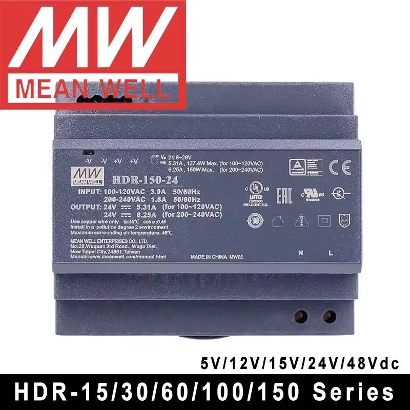
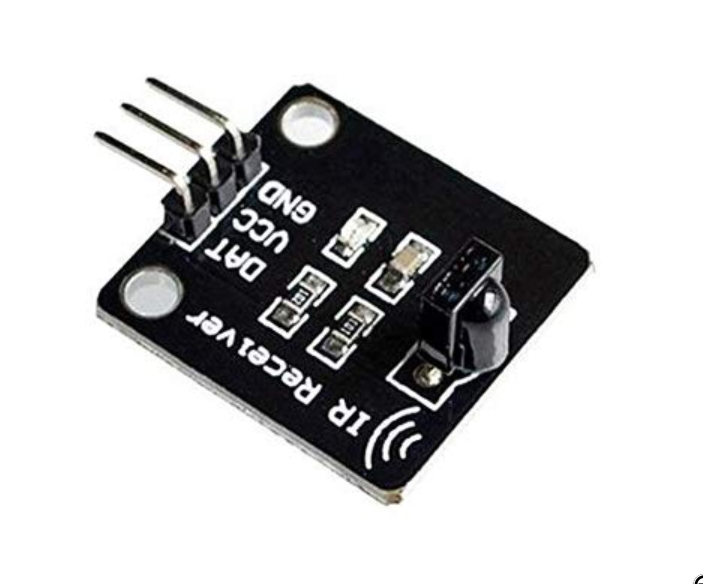

# ESPHome QuinLED-An-Penta-Mini Motion Controller Light with Day Schedule

This repo contains a set of configuration files for creating an ESPHome
firmware for a QuinLED-An-Penta-Mini board with a motion sensor to control
a light based on motion and a day schedule taking into account both sunrise
and sunset times as well as day/night transition times.

While there is nothing preventing you from connecting a device running this project
to [Home Assistant](https://www.home-assistant.io/), it is intentionally made in a way that allows it to work fully
autonomously except for network access (for accessing the web interface) and an
NTP server to be able to sync the current time.

# Features

- [x] Based on high quality QuinLED-An-Penta controller
  - [x] Supports both Mini and Plus Variants 
- [x] Supports both CCT and RGBW LED strips
- [x] Motion detection using multiple C4001 24GHz mmWave radar sensors
- [x] Day/Night schedule
  - [x] Based on sunrise/sunset times
  - [x] User-configurable morning and nighttime
  - [x] User-configurable brightness and color temperature
- [x] Web interface for configuration and quick access
  - [x] Fully autonomous operation if desired, no need for Home Assistant
- [x] (Optional) IR Remote Control integration (see [ESPHome-IR-Light](https://github.com/markusressel/ESPHome-IR-Remote-Light) to add your own remote)
- [x] User override mode for full manual control
  - [ ] Automatic reset to schedule each night at 4:00 AM (configurable)

## Web Interface

The web interface is provided by ESPHome and can be accessed by navigating to
the IP address of the ESPHome device in a web browser.

## Day/Night Schedule

The day/night schedule takes into account both user-configurable "morning time" and "night time",
as well as the state of the sun (below or above horizon). Based on these inputs a "schedule state"
is determined, which defines the brightness and color temperature of the light. The schedule state
includes the following states:

- `day`
- `transition`
- `night`

## Hardware

### Power Cable

To plug in to the wall we need a power cable. You can buy any commonly available
one and cut of one end to get access to the two leads. I recommend using a cable
with a ground wire, but it is not strictly necessary (and not supported by the 
power supply mentioned below).

Example: White 5M Slim EU 2 Prong Port AC Power Cord 

### Power Supply

I am using a MeanWell-HDR-150 in the 24V variant. Its meant to be mounted inside of a
fuse box, but can also easily be used separately. Compared to other power supplies it has a pretty
small footprint and is completely fan-less, but it also requires some room around it to "breathe" 
and cool down.

### LED Controller

This config is setup for a [QuinLED-An-Penta-Mini](https://quinled.info/quinled-an-penta-mini/).

As well as an [QuinLED-An-Penta-Plus](https://quinled.info/quinled-an-penta-plus/).

If you want to use a different controller, this repo should still work, but you will probably
have to change the `device_base` package referenced in the main config and update the defined pins.

### LED Strip

I am using a 5m 24V 120LED/m CCT (Warm White + Cold White) LED Strip (`AXM-SL2835WWCW120NP-W245-H95`):

Although this is a very high CRI strip (>95) my experience with it is mixed, see [here](https://www.reddit.com/r/led/comments/1741sh4/comment/m282rvo/?utm_source=share&utm_medium=web3x&utm_name=web3xcss&utm_term=1&utm_content=share_button).

The range of color temperature settings is reflected by this LED strip (2700K - 5500K). If you
have a different LED strip, you will have to adjust the `min` and `max` values in the [config.yaml](config.yaml)
accordingly.

This project supports using both a color temperature based LED strip (CCT) as well as an RGBW led strip.
Make sure to import the correct `light` package at the top of the [config.yaml](config.yaml) file. The
default is set to CCT.

### Motion Sensor

I am using two C4001 24GHz mmWave radar sensor to detect presence.

While it is not cheap, it is capable of flawless detection of presence
even without motion over quite a lot of distance (I tested up to 4 meters).

Be aware that this sensor is actively sending out a signal to detect presence,
so using multiple of them in proximity or oriented at each other might cause interference
that could lead to false positives.

It supports configuration via UART, but I simply use it in its default config
which only needs three wires (per sensor).

#### 3D Printed Case

I have designed a 3D printable cases for the sensors mentioned above.  
The files can be found here: [C4001 Motion Sensor 3D Printable Cases](./3dprints/Motion%20Sensor/)

### Optional: IR Remote Control

Digital 38khz IR Infrared Receiver Sensor Module

See this project for more information: [ESPHome-IR-Remote-Light](https://github.com/markusressel/ESPHome-IR-Remote-Light)

### Wiring

## Software

### Preparing the Environment

1. Install [ESPHome](https://esphome.io/guides/getting_started_command_line.html) on your computer.
2. Clone this repository.
3. Copy the `secrets.yaml.example` (see [here](./secrets.yaml.example)) to `secrets.yaml` and fill in the required values

### Flash the Firmware

1. Connect the QuinLED-An-Penta-Mini to your computer using a USB cable.
2. Run `esphome rum ./QuinLED-An-Penta-Mini-Motion-Light-with-Day-Schedule.yaml` in the root of this repository.
3. Follow the instructions to flash the firmware via USB.
4. After flashing, ensure the device is connected to your network, has an IP address and 
   you can access its web interface from another device on the same network.
5. If everything is working, disconnect the USB cable and connect the power cable from the power supply.

And that's it! You should now have a fully autonomous light that turns on when motion is detected
and adjusts its brightness and color temperature based on the time of day and the state of the sun.

# FAQ

## The lights turn on too slowly

The transition duration can be configured via the web interface for both the
turning off and on transitions. The default values are rather slow to allow the
human eye to adapt to the new lighting environment more easily.

## The timeout for turning off the light is too short/long

Besides any delay applied by the sensors themselves, you can
configure an additional delay via the web configuration. If this delay is set to
0 the sensor input is applied immediately on detection. If the detection is not working
as expected I would recommend taking a closer look at the motion sensors you are using.
Some let you reconfigure them, others are just bad. If you are not using the sensors 
mentioned above I highly recommend checking them out as they have been flawless for me
and good presence detection is crucial for a good user experience.

## The light does not change brightness when on during state changes (f.ex. day -> transition)

This is expected.

The logic to compute the correct state is only triggered by changes from the motion sensors
or turning on the light manually. This is intentional to avoid confusing changes to the light
brightness and color while it is on, as the assumption is that the light will only be on
for a short amount of time, or changes in motion sensor activity.
