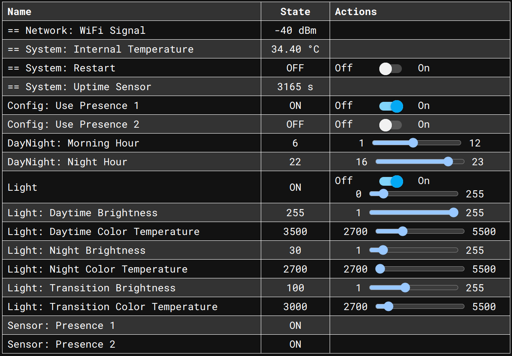
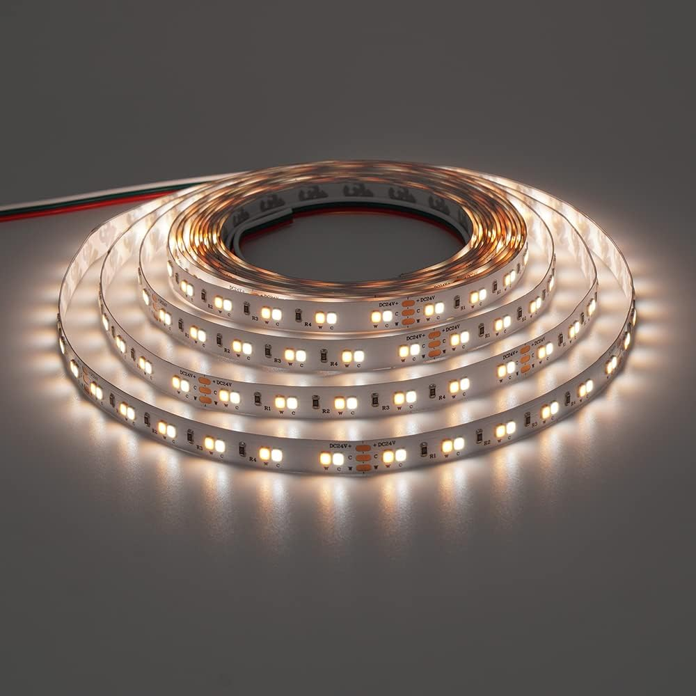
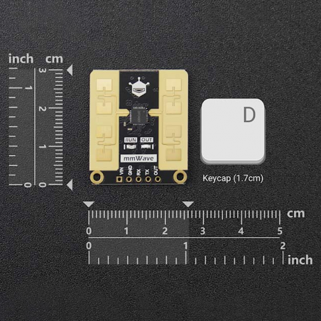

# ESPHome QuinLED-An-Penta-Mini Motion Controller Light with Day Schedule

This repo contains a set of configuration files for creating an ESPHome
firmware for a QuinLED-An-Penta-Mini board with a motion sensor to control
a light based on motion and a day schedule taking into account both sunrise
and sunset times as well as day/night transition times.

While there is nothing preventing you from connecting a device running this project
to [Home Assistant](https://www.home-assistant.io/), it is intentionally made in a way that allows it to work fully
autonomously except for network access (for accessing the web interface) and an
NTP server to be able to sync the current time.

## Web Interface

The web interface is provided by ESPHome and can be accessed by navigating to
the IP address of the ESPHome device in a web browser.

## Day/Night Schedule

The day/night schedule takes into account both user-configurable "morning time" and "night time",
as well as the state of the sun (below or above horizon). Based on these inputs a "schedule state"
is determined, which defines the brightness and color temperature of the light. The schedule state
includes the following states:

- `day`
- `transition`
- `night`

## Hardware

### LED Controller

This config is setup for a [QuinLED-An-Penta-Mini](https://quinled.info/quinled-an-penta-mini/).

If you want to use a different controller, this repo should still work, but you will probably
have to change the `device_base` packages referenced in the main config and update the defined pins.

### LED Strip

I am using a 5m 24V 120LED/m CCT (Warm White + Cold White) LED Strip (`AXM-SL2835WWCW120NP-W245-H95`):

Although this is a very high CRI strip (>95) my experience with it is mixed, see [here](https://www.reddit.com/r/led/comments/1741sh4/comment/m282rvo/?utm_source=share&utm_medium=web3x&utm_name=web3xcss&utm_term=1&utm_content=share_button).

The range of color temperature settings is reflected by this LED strip (2700K - 5500K). If you
have a different LED strip, you will have to adjust the `min` and `max` values in the [config.yaml](config.yaml)
accordingly.

### Motion Sensor

I am using two C4001 24GHz mmWave radar sensor to detect presence.

While it is not cheap, it is capable of flawless detection of presence
even without motion over quite a lot of distance (I tested up to 4 meters).

It supports configuration via UART, but I simply use it in its default config
which only needs three wires (per sensor).

### Wiring

# FAQ

## The timeout for turning off the light is too short/long

There is no hardcoded timeout built in to this configuration.

The sensor input is applied immediately when detected. If the detection is not working
as expected I would recommend taking a closer look at the motion sensors you are using.
Some let you reconfigure them, others are just bad. If you are not using the sensors 
mentioned above I highly recommend checking them out as they have been flawless for me
and good presence detection is crucial for a good user experience.

Of course you can also modify this configuration to add a timeout yourself to make
non-optimal sensors work better.

## The light does not change brightness when on during state changes (f.ex. day -> transition)

This is expected.

The logic to compute the correct state is only triggered by changes from the motion sensors
or turning on the light manually. This is intentional to avoid confusing changes to the light
brightness and color while it is on, as the assumption is that the light will only be on
for a short amount of time, or changes in motion sensor activity.
